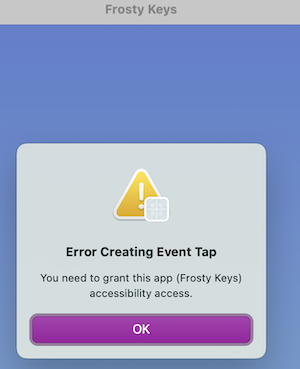
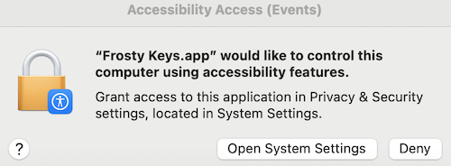
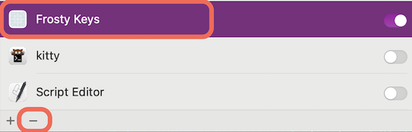

# FrostyKeys

Freeze your keyboard so you can clean it without `fmdfsmldsfmdfmndsmfn..`

## Build

```bash
❯ make
..
..
❯ open ./build/Frosty\ Keys.app
```

## Grant Accessability Access

You need to provide access to the app so it can access the event tap APIs. You can follow the steps below to ensure that you have proper access to launch the app successfully:

1. Open the app manually from finder or the terminal e.g. `open ./build/Frosty\ Keys.app`

1. First error message might look like this:


1. You should see a dialog for accessibility  access as shown in the screenshot (sometimes it's hidden behind the app's window)


1. **Optional**: in case you don't see the accessability access dialog, you might need to remove the app from the accessibility list in
`System Settings -> Privacy & Security -> Accessability` and selecting the `Frosty Keys` app and `-` button to remove (as shown in the screenshot). You can go back to the first step and try again.

